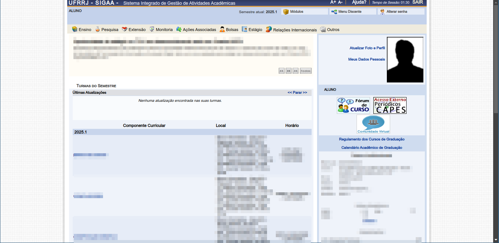
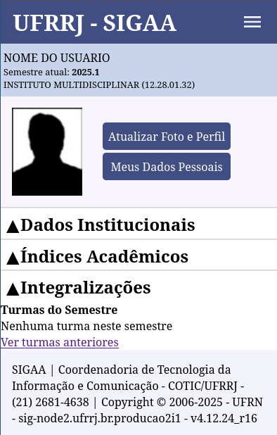
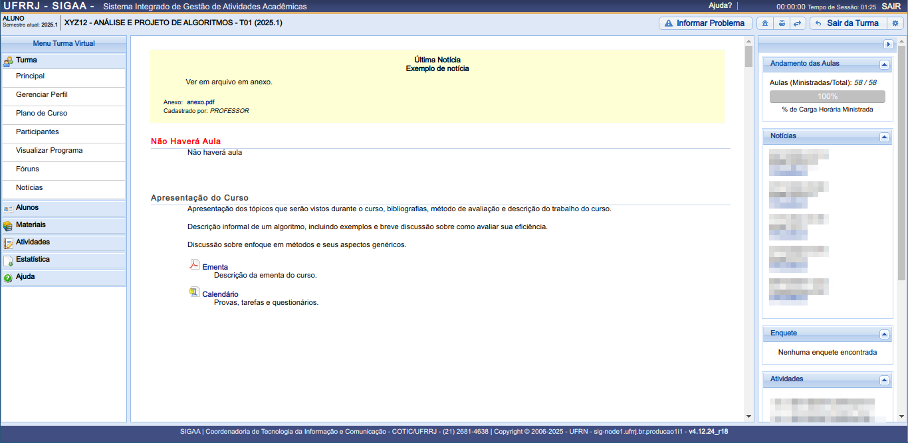
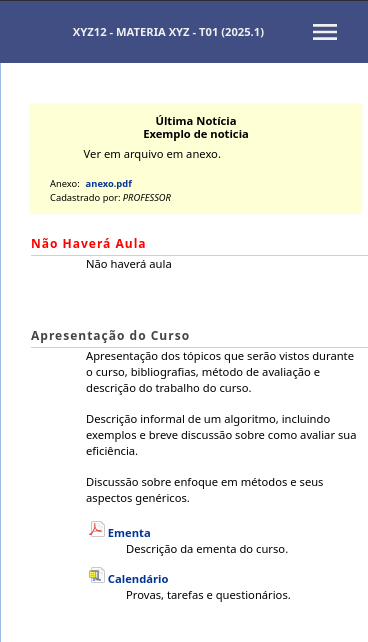

# Sigaa Mobile

Essa extensão visa melhorar o visual antigo e confuso do sigaa da UFRRJ para uma melhor naveção nos dispositivos móveis, focando nos recursos essenciais.

## Página Inicial
A página inicial foi completamente refeita, simplificando significativamente a navegação:

### Antes

### Depois

## Página de Aula
Outra página mudada foi a página de cada matéria, nela foi mantido apenas a turma virtual

### Antes

### Depois
